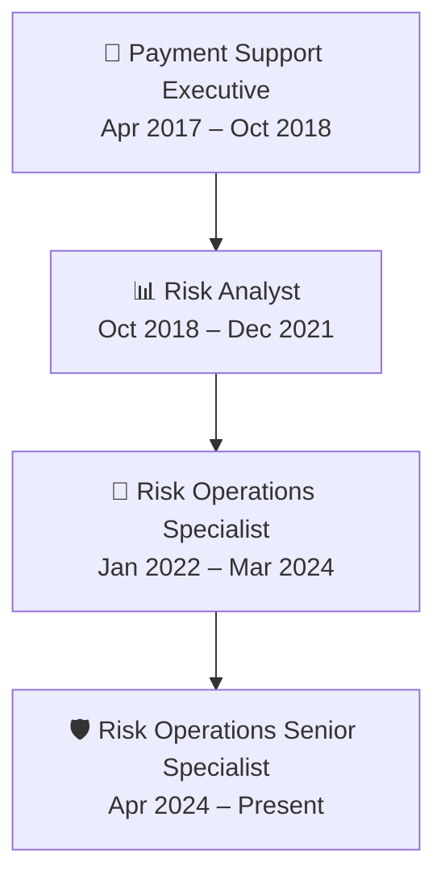

# 🛤️ Career Journey

*All progression built within Grab (GPay Networks Sdn. Bhd.), across 5 Southeast Asian markets.*

---

## 🎫 Payment Support Executive
**April 2017 – October 2018**

Started in regional GrabPay payment operations and trust & safety, handling KYC screening, transaction monitoring, and compliance-aligned escalation resolution. This is where the foundation for everything after it was built — understanding the transaction lifecycle from the ground up.

## 📊 Risk Analyst
**October 2018 – December 2021**

Moved into dedicated risk casework: resolving complex cases across payments, banking, and chargebacks.

- Built the first SQL scripts and Tableau dashboards used for exposure analysis and ongoing monitoring
- Reduced case handling time by **50%** through process optimization and improved risk assessment
- Began training other analysts on SQL and SOPs, and advised Policy on investigation framework enhancements

## 🔧 Risk Operations Specialist
**January 2022 – March 2024**

- Designed end-to-end law enforcement escalation workflows, with structured, time-bound resolution plans for senior stakeholder escalations
- Built executive dashboards and MI using **Tableau, Zendesk, and SQL**
- Led quality assurance of control framework SOPs before publication

## 🛡️ Risk Operations Senior Specialist
**April 2024 – Present**

Currently leading first-line financial crime operations for a **12-member regional team** across five Southeast Asian markets, with responsibility for risk-based decision-making, quality assurance, and SLA performance.

| Initiative | Impact |
|---|---|
| 👮 Primary liaison, Singapore Police Force | **SPF Outstanding Stakeholder Award (2025)** |
| 🤖 Automated investigation workflow (law enforcement tooling) | Per-case time cut from 30 → 10 minutes; ~33 operational hours saved monthly across ~100 cases |
| 🧠 AI-powered investigation platform | Built with Product, Data Analytics & Engineering — standardized decisioning, no added headcount |
| 🔄 Microsoft Dynamics 365 redesign | Single source of truth; real-time MI, no duplicate processes |
| 📈 Google Apps Script automation | Real-time management information for leadership |
| 📚 AI-powered knowledge platform | Centralized investigation SOPs across regional markets |
| 🏛️ National Fraud Portal | Represented Grab in regulatory reporting initiatives |
| 🏪 Merchant risk & typology analysis | SQL-driven analytics, partnered with Policy & business leadership |

---

## 🏆 Recognitions Along the Way

| Award | Issued By | Date |
|---|---|---|
| 🥇 **SPF Outstanding Stakeholder Award** | Singapore Police Force | 2025 (Jan 2026) |
| 🌟 **Grab 4H Award** | Grab | March 2023 |
| ⭐ **Spot On Award** | Grab | May 2022 |

---
