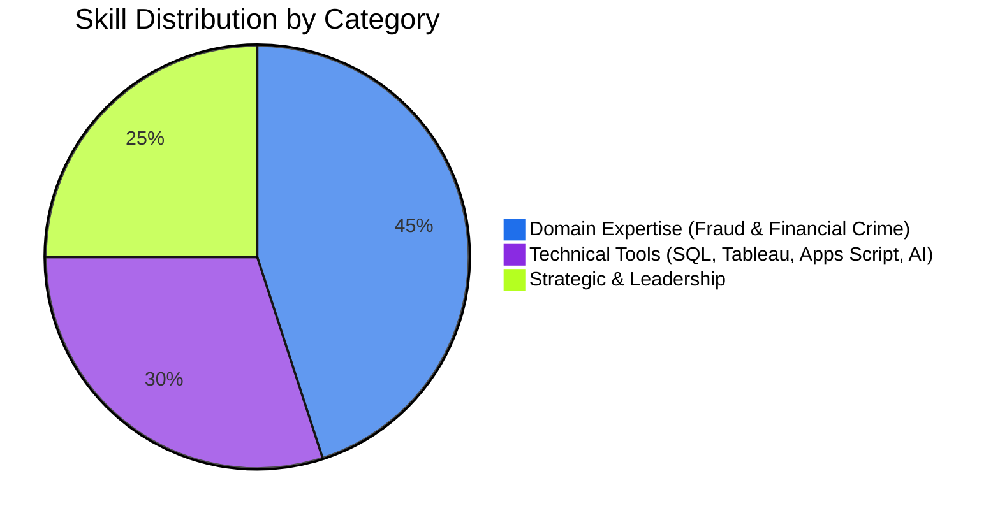

# 🛠️ Core Skills

---

## Skill Matrix

| Skill | Category | Proficiency |
|---|---|---|
| Fraud Operations | Domain | ⭐⭐⭐⭐⭐ |
| Financial Crime | Domain | ⭐⭐⭐⭐⭐ |
| Merchant Risk | Domain | ⭐⭐⭐⭐⭐ |
| Chargebacks & Disputes | Domain | ⭐⭐⭐⭐⭐ |
| Transaction Monitoring | Domain | ⭐⭐⭐⭐⭐ |
| Risk Strategy | Strategic | ⭐⭐⭐⭐⭐ |
| Law Enforcement Collaboration | Domain | ⭐⭐⭐⭐ |
| SQL | Technical | ⭐⭐⭐⭐ |
| Tableau | Technical | ⭐⭐⭐⭐ |
| Google Apps Script | Technical | ⭐⭐⭐⭐ |
| AI-Assisted Investigations | Technical | ⭐⭐⭐⭐ |
| Process Improvement | Strategic | ⭐⭐⭐⭐⭐ |

---

## 🕵️ Domain Skills

- **Fraud Operations** — end-to-end case investigation, fraud typology identification, ring detection, and loss prevention
- **Financial Crime** — customer due diligence support, suspicious activity identification, and compliance partnership
- **Merchant Risk** — onboarding risk assessment, ongoing merchant monitoring, and risk-scoring frameworks
- **Chargebacks & Disputes** — dispute resolution workflows, representment strategy, and chargeback loss mitigation
- **Transaction Monitoring** — rule design, threshold tuning, alert triage, and anomaly detection
- **Law Enforcement Collaboration** — evidence packaging, liaison communication, and regulatory cooperation protocols

## 💻 Technical Skills

- **SQL** — complex querying for pattern discovery, case analytics, and automated reporting
- **Tableau** — dashboard design translating raw fraud data into executive-ready insight
- **Google Apps Script** — workflow automation for investigations, reporting, and team efficiency
- **AI-Assisted Investigations** — using AI tooling to accelerate triage, summarization, and pattern recognition

## 🧠 Strategic & Leadership Skills

- **Risk Strategy** — designing policies and frameworks that scale across products and markets
- **Process Improvement** — re-engineering workflows to reduce cycle time and increase investigation quality
- **Cross-Functional Leadership** — aligning Compliance, Product, Engineering, and Legal around shared risk objectives
- **Stakeholder Communication** — translating complex fraud data into clear narratives for leadership and external partners

---

## Skills Radar

---

---
