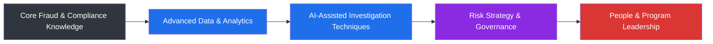

# 📚 Learning Roadmap

## Philosophy on Learning

Fraud and financial crime are moving targets — the typologies of tomorrow won't look like the typologies of today. Staying effective in this field means treating learning as a **continuous, non-negotiable practice**, not a one-time credential.

---

## Roadmap Overview

---

## Current Focus Areas

- 🧠 **AI-Assisted Investigations** — deepening practical skills in using AI tools to accelerate case triage, summarization, and pattern detection
- 📊 **Advanced Tableau & SQL** — expanding dashboarding and query optimization capabilities for larger, more complex datasets
- 📜 **AML/KYC Formal Certification** — working toward recognized credentials in anti-money laundering compliance
- ⚙️ **Automation with Google Apps Script** — building more sophisticated automated workflows for investigation and reporting

## Future Focus Areas

- 📈 **Enterprise Risk Management frameworks** — preparing for broader strategic risk governance responsibilities
- 👥 **People Leadership & Management** — developing the coaching, hiring, and team-building skills required at manager level
- 🌍 **Cross-Border Regulatory Knowledge** — building fluency in fraud and financial crime regulatory frameworks across UK, EU, and APAC markets

---

