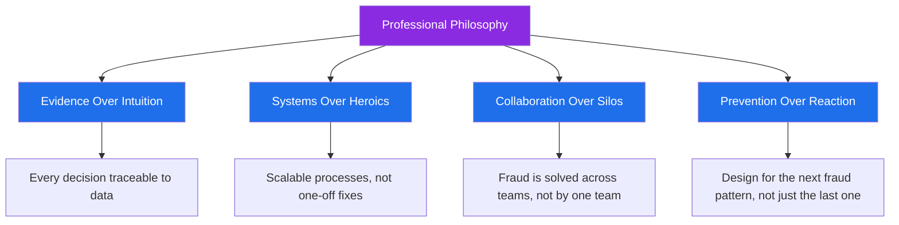

# 🧠 Professional Philosophy

## Guiding Belief

> **"Fraud prevention is not about catching every bad actor — it's about designing systems that make good behavior easy and bad behavior expensive."**

I approach fraud and financial crime work as a discipline that sits at the intersection of **data, psychology, and process design**. Every fraud pattern is, at its core, a signal — and my job is to build the systems, rules, and teams that can hear that signal clearly and act on it quickly.

---

## The Four Pillars

### 1. Evidence Over Intuition
Every investigative conclusion should be defensible with data. Intuition can guide *where* to look, but evidence determines *what* gets decided.

### 2. Systems Over Heroics
A great investigator solving one case is valuable. A great process preventing a thousand future cases is transformative. I optimize for the latter.

### 3. Collaboration Over Silos
Fraud doesn't respect organizational boundaries — it moves across product, payments, and merchant ecosystems. Effective fraud prevention requires the same cross-functional fluidity.

### 4. Prevention Over Reaction
The best fraud teams spend as much time anticipating the *next* typology as they do resolving the *current* one.

---

## Philosophy in Practice

- I design **transaction monitoring rules** with tomorrow's fraud pattern in mind, not just yesterday's.
- I treat **chargebacks and disputes** as a feedback loop for improving upstream fraud controls, not just a loss to absorb.
- I use **AI-assisted investigation techniques** to increase the speed and consistency of triage — while keeping human judgment central to final decisions.
- I approach **law enforcement collaboration** as a long-term relationship built on precision, responsiveness, and mutual trust.

---

## On Fraud & Human Behavior

Fraud is ultimately a human behavior problem expressed through data. Understanding *why* fraud happens — incentive structures, friction points, detection gaps — is just as important as understanding *how* it happens. This belief shapes how I design controls: not just to catch fraud, but to make the entire ecosystem more resistant to it over time.

---

