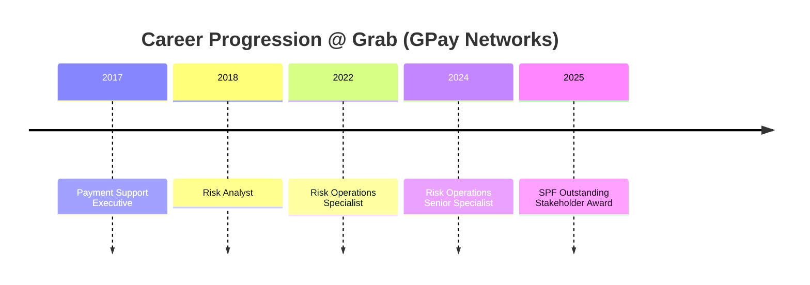

# 🛡️ Kaliswary Ramish

### Senior Fraud Operations & Financial Crime Professional

**9+ years** securing payment ecosystems across **5 Southeast Asian markets**

`SQL` · `Tableau` · `Microsoft Dynamics 365` · `Google Apps Script` · `AI-Assisted Investigation` · `Lean Six Sigma Green Belt`

---

## 👋 Who Am I?

I'm a fraud operations and financial crime professional who has spent 9+ years inside one of Southeast Asia's largest fintech platforms — Grab (GPay Networks Sdn. Bhd.) — investigating fraud, assessing merchant risk, and building the tooling that lets regional teams operate at scale. I currently lead first-line financial crime operations for a **12-member regional team** across **5 markets**, and I'm the primary liaison to the **Singapore Police Force** on financial crime prevention.

## 🎯 What Do I Specialize In?

| Domain | What that looks like day to day |
|---|---|
| 🔍 **Fraud Investigation** | Case resolution across payments, banking, and chargebacks |
| 🏪 **Merchant Risk** | Assessing merchants for emerging financial crime typologies |
| 🔐 **Account Takeover Investigation** | Part of regular day-to-day casework |
| 👮 **Law Enforcement Liaison** | Primary SPF contact — [SPF Outstanding Stakeholder Award 2025](./Career-Journey.md) |
| ⚙️ **Workflow & MI Automation** | Dynamics 365 redesign, Google Apps Script, AI-assisted tooling |

## 📊 At a Glance

| 9+ | 5 | 12 | 66%↓ |
|:---:|:---:|:---:|:---:|
| Years in Fraud Ops | SEA Markets Covered | Team Members Led | Case Handling Time Reduced |

## 🗺️ Career at a Glance

## 📁 Why This Repository?

I built **Fraud-Operations-Lab** to make internal, invisible work — case investigations, control redesigns, regional operations — legible to people outside the organization I built it in. Every section is grounded in verified experience; nothing here is exaggerated.

## 🧭 Folder Navigation

| File | What You'll Find |
|---|---|
| 📄 [`Professional-Profile.md`](./Professional-Profile.md) | Problems I solve & how I approach investigations |
| 🛤️ [`Career-Journey.md`](./Career-Journey.md) | Role-by-role progression, in detail |
| 🧰 [`Core-Skills.md`](./Core-Skills.md) | Tools & domains I bring to fraud/financial crime work |
| 🧠 [`Professional-Philosophy.md`](./Professional-Philosophy.md) | How I think about risk, controls & investigations |
| 💡 [`Why-This-Portfolio.md`](./Why-This-Portfolio.md) | The reasoning behind this repository |
| 📚 [`Learning-Roadmap.md`](./Learning-Roadmap.md) | What I'm developing right now |
| 📬 [`Contact.md`](./Contact.md) | How to reach me |

*"Good fraud operations aren't just about catching bad actors — they're about building controls that hold up under pressure, scale across markets, and still respect the customer on the other side."*

