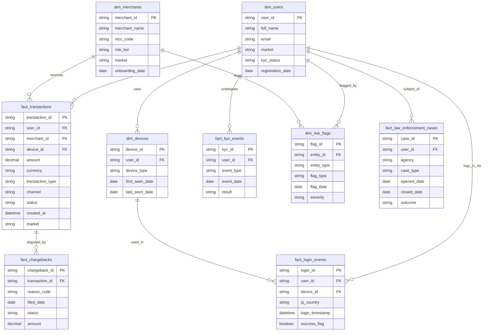

# Database Schema

**Purpose:** Define NovaPay's fraud/risk data model used across all investigation SQL.
**Estimated reading time:** 5 minutes
⬅️ [Back to README](./README.md)

## Entity Relationship Diagram

## Table Summary

| Table | Grain | Used in |
|---|---|---|
| `dim_users` | 1 row per user | All investigations |
| `dim_merchants` | 1 row per merchant | INV-001, INV-004 |
| `dim_devices` | 1 row per device | INV-002 |
| `fact_transactions` | 1 row per transaction | All investigations |
| `fact_chargebacks` | 1 row per chargeback | INV-001, INV-009 |
| `fact_login_events` | 1 row per login attempt | INV-002 |
| `fact_kyc_events` | 1 row per KYC check | INV-002, INV-010 |
| `dim_risk_flags` | 1 row per flag raised | INV-002, INV-004, INV-009 |
| `fact_law_enforcement_cases` | 1 row per LE case | INV-010 |

⬅️ [Back to README](./README.md)
