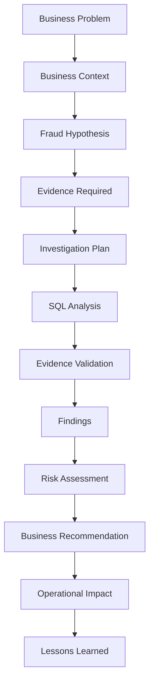

# Investigation Methodology

**Purpose:** The fixed sequence every investigation in this repo follows.
**Estimated reading time:** 3 minutes
⬅️ [Back to README](./README.md)

## The sequence

## Why this order, not SQL-first

SQL is a tool for testing a hypothesis about fraud behavior — it is never the starting point. Starting with
a business problem forces the investigation to stay anchored to what actually matters: loss exposure, user
harm, or regulatory risk. An investigation that starts with "here's an interesting query" tends to produce
findings nobody asked for and recommendations nobody can act on.

## What each stage answers

| Stage | Question it answers |
|---|---|
| Business Problem | What's going wrong, and why does it matter? |
| Business Context | What do we already know about this part of the business? |
| Fraud Hypothesis | What specific fraud behavior do we suspect? |
| Evidence Required | What data would prove or disprove the hypothesis? |
| Investigation Plan | How will we structure the analysis? |
| SQL Analysis | What does the data actually show? |
| Evidence Validation | Is the SQL result reliable and complete? |
| Findings | What did we learn? |
| Risk Assessment | How serious is this, and for whom? |
| Business Recommendation | What should the business do about it? |
| Operational Impact | What changes if the recommendation is adopted? |
| Lessons Learned | What would we do differently next time? |

⬅️ [Back to README](./README.md)
